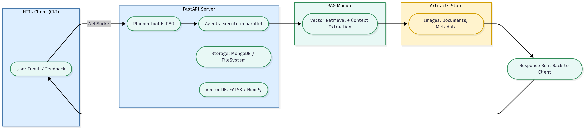

# AI Compliance & Risk Orchestrator

this repo focuses strictly on the **Core Requirements**.
It is intentionally practical, with fallbacks so it runs on a basic laptop even if MongoDB/Redis are not available.

## Tech stack
- **FastAPI** server (async) with **WebSocket** for HITL
- **Parallel, multi‑agent** orchestration via `asyncio.gather`
- **RAG** using Sentence Transformers + FAISS (with numpy fallback)
- **MongoDB** (via `motor`) for session/state (falls back to JSON files if not configured)
- **Redis** (optional) for caching (falls back to in‑process LRU)
- **OCR** via `pytesseract` (falls back to plain image OCR stub if Tesseract is not installed)

## Quick start

```bash
python -m venv .venv && source .venv/bin/activate  # (Windows: .venv\Scripts\activate)
pip install -r requirements.txt

# Start the API server
uvicorn server.app:app --reload

# (In another terminal) start the HITL client
python client/client.py --session S1
```

OpenAPI docs: http://localhost:8000/docs

### Environment
Copy `.env.example` to `.env` and adjust if you have MongoDB/Redis locally. If not, the app will run using built‑in fallbacks.

## Endpoints & Protocol (Minimum)
- `WS /connect?session_id=` — server → client: `hitl_request`, `progress_update`
- `POST /ask` — start a job `{session_id, question, attachments?}` → returns `{job_id}`
- `GET /result?job_id=...` — fetch final JSON when done
- `POST /hitl` — alternative to WS for human replies
- `GET /history?session_id=...` — session log (messages, citations, timings, costs)

## Architecture



**Fan‑out / Fan‑in:** Policy, Evidence, Vision/OCR, Code agents run in **parallel** → merged → Risk Scorer → Red‑Team Critic → Final Aggregator.

## Sequence (two HITL interruptions)

```
User -> POST /ask
Server -> progress_update(planner_started)
Server runs parallel agents
Critic flags gap -> server -> HITL prompt (clarification)
Client replies
Vision agent needs screenshot -> server -> HITL prompt (upload_request)
Client uploads -> resume
Server -> finalized -> GET /result
```

## Demo script
See `demo_script.md` for 3 runs:
1) Normal compliant (no HITL)
2) Run with 2 HITL steps (clarification + upload)
3) Run ending as `insufficient_evidence` after timeout

## Known limitations
- OCR quality depends on local Tesseract install; otherwise a stub runs.
- Vector index is in‑process for demo; production should use a managed vector DB.
- Minimal tests focus on schema and guardrails to keep scope tight for Round‑2.

---

**Grading rubric mapping**
1) HITL over network (server‑initiated WS, resume flow)
2) Parallel multi‑agent (`asyncio.gather` with timeouts/retries)
3) RAG quality (exact‑match + embedding search + citations)
4) Guardrails & schema (Pydantic model + JSON schema validation)
5) State & memory (Mongo or JSON files; session log + costs)
6) Multimodality (image input accepted; OCR influences decision)
7) Reliability (tenacity retries, timeouts, circuit breaker)
8) API design (clear endpoints + streaming‑style progress)
9) Code quality (typed modules, comments, small tests)
